# Operationalizing Machine Learning

The goal of this project is to use AzureML to configure a cloud-based machine learning production model, then deploy it to an endpoint for consumtion. Furthermore, the whole workflow will be built into a automated pipeline, which will then be published and consumed whenever we need to retrain the model.
The [Bank Marketing dataset](https://automlsamplenotebookdata.blob.core.windows.net/automl-sample-notebook-data/bankmarketing_train.csv) is used as the training dataset for the AutoML model.

## Architectural Diagram

The image below shows the Architectural Diagram of the project, which train a ML model to predict bank marketing campaign data using AutoML. The model will be consumed by the REST endpoint. The pipeline encapsulate all the steps in order to automatically trigger a new experiment run and deploy the newly trained model to the same endpoint for continuous consumption and improvement.

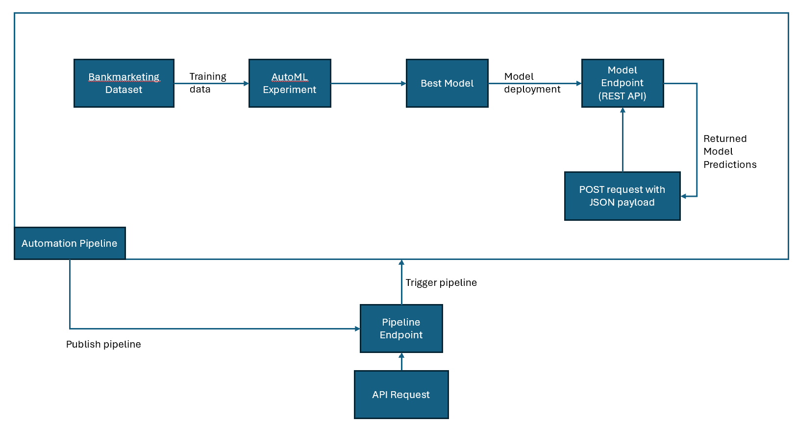

## Key Steps
### 1. Create and run Auto ML Experiment
In this step, an experiment using Automated ML is created and run using a compute cluster. After the experiment is completed, the best model will be selected for deployment.

#### Register Bankmarketing Dataset in AzureML.
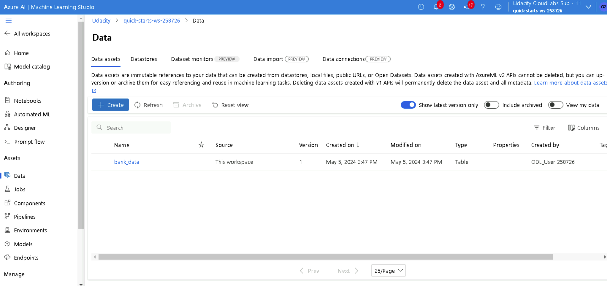

#### The experiment is run and finally completed
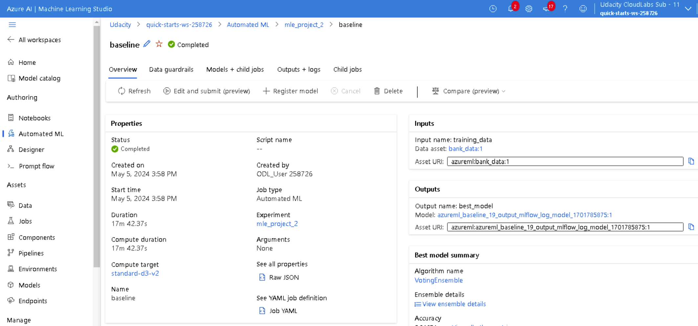

#### The best model is selected for deployment
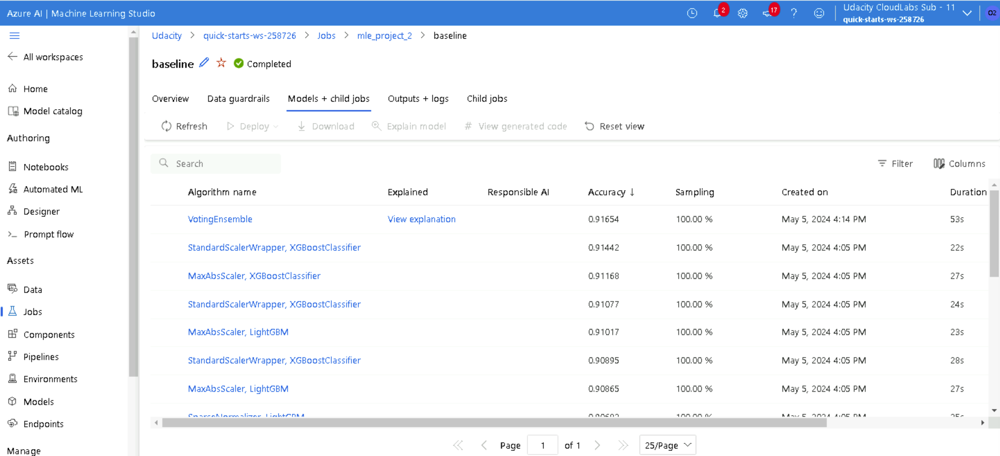

### 2. Deploy the model
In this step, we deploy the best model in step 1.
(no screenshots are required)

### 3. Enable Application Insights
In this step, we enable Application Insights and retrieve logs.

#### Application Insights is enabled
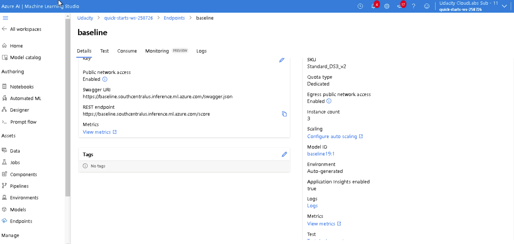

#### The logs are retrieved and displayed in the terminal
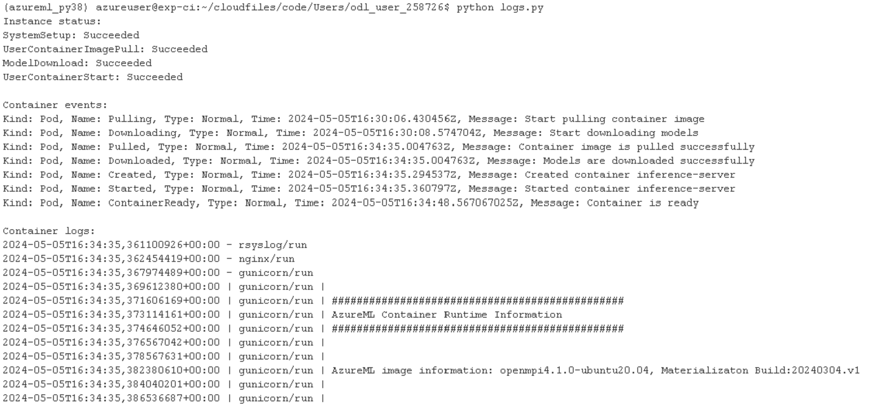

### 4. Consume model using Swagger

In this step, we document the consumption of the deployed model using Swagger.

#### Swagger Documentation Overview
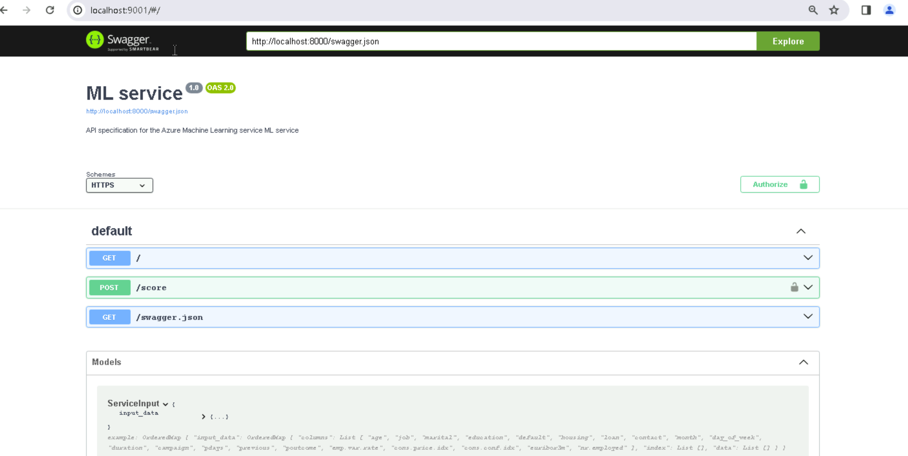

#### Expanding Swagger Documentation for POST request
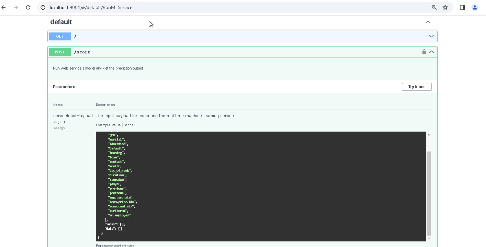

### 5. Consume Model Endpoints
In this step, we run the endpoint.py script to interact with the deployed model endpoint. The JSON payload is provided in the script to test out the model.

#### Request the endpoint and get the outputs

### 6. Create, Publish and Consume a Pipeline

In this step, we use the [Jupyter Notebook](./aml-pipelines-with-aml-step.ipynb) to create and publish the Pipeline that trigger the AutoML step and deploy new model.

#### Pipeline is created
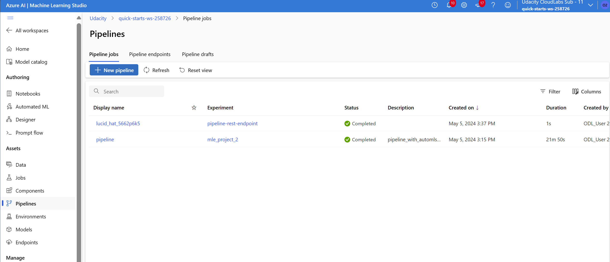

#### Pipeline details
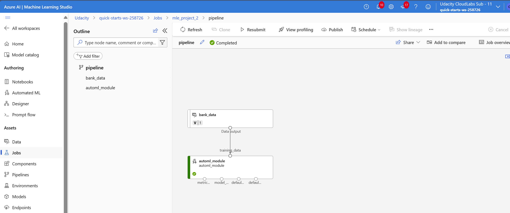

#### Pipeline endpoint information
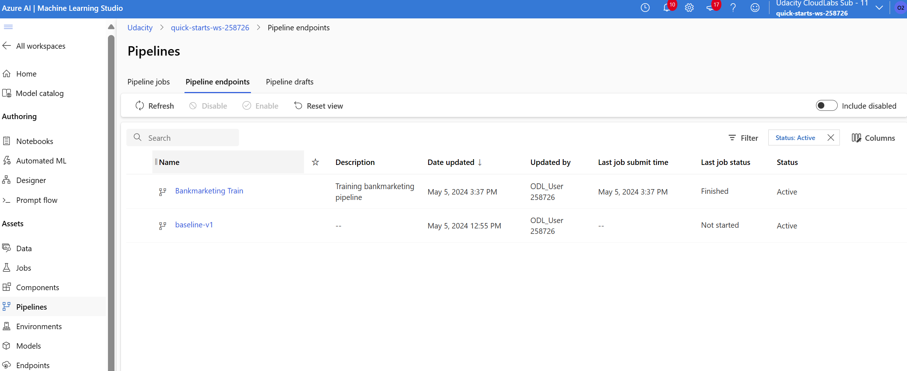

#### Pipeline is published
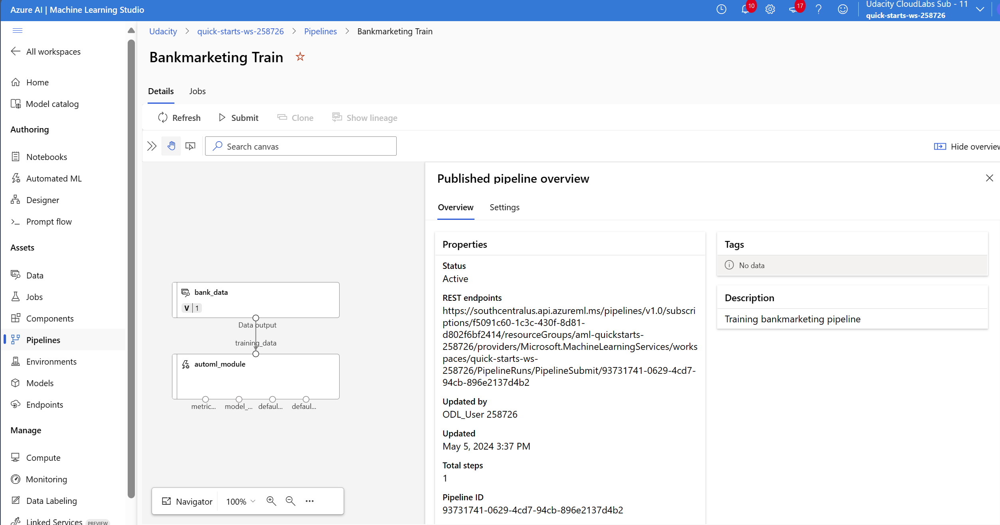

#### Pipeline steps containing the dataset and AutoML
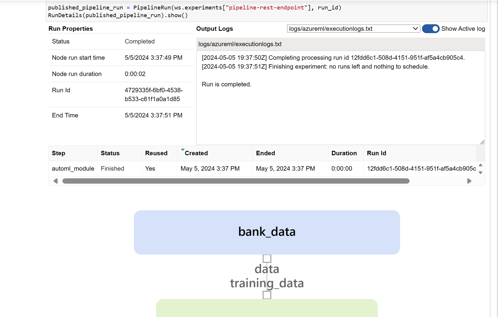

#### The scheduled pipeline run
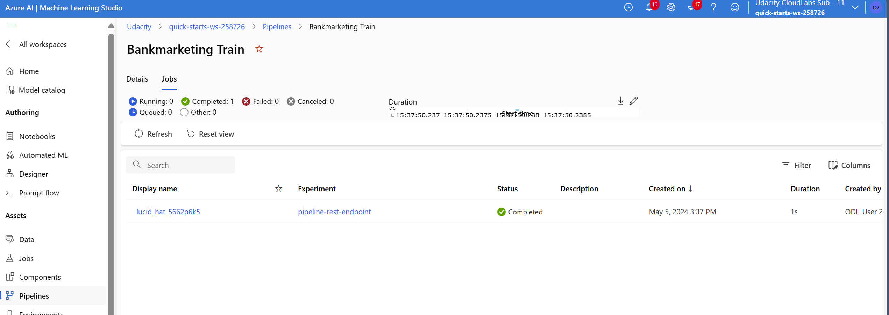

## Screen Recording
This screencast [YouTube video](https://www.youtube.com/watch?v=BbxIHmh-Qw0) demonstrates the entire process of the working ML application:
- Working deployed ML model endpoint
- Deployed pipeline
- Available AutoML model
- Successful API requests to the endpoint with a JSON payload

## Future Work

To further improving the project, some suggestions are:
- Handling the data imbalance issue
- Experiment with longer AutoML run timeout to search for better models
- Enhance the data collection step in the pipeline to automate data collection and versioning.