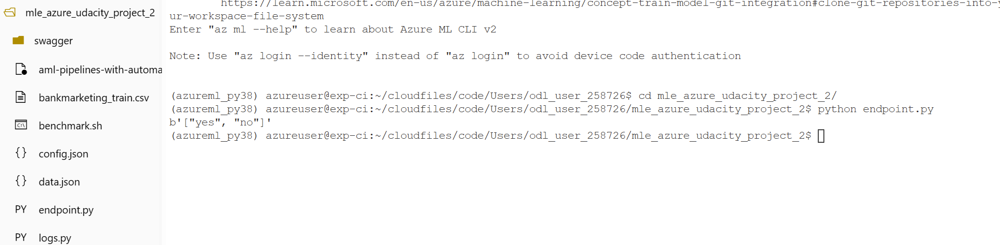

# Operationalizing Machine Learning

The goal of this project is to use AzureML to configure a cloud-based machine learning production model, then deploy it to an endpoint for consumtion. Furthermore, the whole workflow will be built into a automated pipeline, which will then be published and consumed whenever we need to retrain the model.
The [Bank Marketing dataset](https://automlsamplenotebookdata.blob.core.windows.net/automl-sample-notebook-data/bankmarketing_train.csv) is used as the training dataset for the AutoML model.

## Architectural Diagram

## Key Steps
### 1. Create and run Auto ML Experiment
In this step, an experiment using Automated ML is created and run using a compute cluster.

### 2. Deploy the model
In this step, we deploy the best model in step 1.
(no screenshots are required)
### 3. Enable Application Insights
In this step, we enable Application Insights and retrieve logs.

### 4. Consume model using Swagger

In this step, we consume the deployed model using Swagger.

### 5. Consume Model Endpoints
In this step, we run the endpoint.py script to interact with the deployed model endpoint.

### 6. Create, Publish and Consume a Pipeline

In this step, we use the [Jupyter Notebook](./aml-pipelines-with-aml-step.ipynb) to create and publish the Pipeline.

## Screen Recording
This screencast [YouTube video](https://www.youtube.com/watch?v=BbxIHmh-Qw0) demonstrates the entire process of the working ML application:
- Working deployed ML model endpoint
- Deployed pipeline
- Available AutoML model
- Successful API requests to the endpoint with a JSON payload

## Future Work

To further improving the project, some suggestions are:
- Handling the data imbalance issue
- Experiment with longer AutoML run timeout to search for better models
- Enhance the data collection step in the pipeline to automate data collection and versioning.